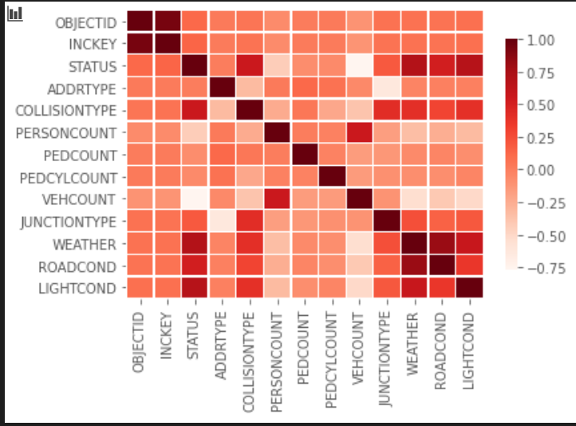
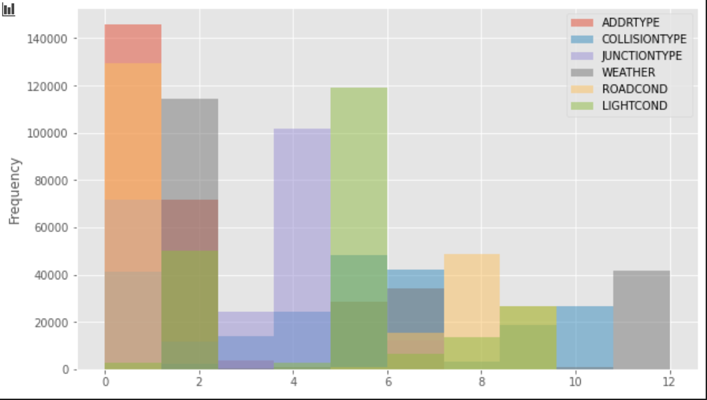

# Introduction/Business Problem

Based on the reports from ASIRT, around 38,000 people die every year in road accidents in the United States. The fatality rate is quite significant which is aorund 12 deaths per 100,000 inhabitants. It is pretty apparent that as the amount of vehicles increase on the roads the number of accidents are also increasing, which obviously means as the number of vehicles increase exponentially it also increases the fatality rate within accidents. In this project we aim to analyze and predict the common causes of accidents allowing us to gain more insight towards this on going problem within the United States. We will be using data provided by the Seattle Department of Transport which will allow us to come to a final conclusion for this ongoing problem.

# Data Used

To reach our target goal of analyze and predict the common causes of accidents we are going to use the data provided by the Seattle Department of Transport, the data set is a very extensive data set which includes around 40 columns which describe a particular accident including the road condition (dry or wet), people involved in the accident, the severity of the accident, if the accident place was a block or an intersection, the type of accident on how the accident occurred (MOTOR VEHICLE STRUCK MOTOR VEHICLE, FRONT END AT ANGLE), the weather and the light condition the accident occurred in. These types of data is very essential for us to actually reach to a final conclusion towards our analysis of the main conditions which actually cause accidents.

# Methodology

With the help of jupyter notebooks I was able to come up with various relationships, first I found out that most of the data was categorical and I would graph my insights which can be seen in the Jupyter notebook where I match some of the variables to oter variables to see the correlation between each and every column. After which I moved to the data cleaning phase and filled up the missing data to avoid any further redundancies within my data science pipeline, once all the missing data was fixed, I was able to go ahead with further inspections and dropped various columns 'X','Y','INTKEY','COLDETKEY','REPORTNO','LOCATION','EXCEPTRSNCODE','EXCEPTRSNDESC','SEVERITYDESC','INJURIES','SERIOUSINJURIES','FATALITIES','INCDATE','INCDTTM','SDOT_COLCODE','SDOT_COLDESC','INATTENTIONIND','UNDERINFL','PEDROWNOTGRNT','SDOTCOLNUM','SPEEDING','ST_COLDESC','SEGLANEKEY','CROSSWALKKEY','HITPARKEDCAR. After which I began to preprocess my data and moved to developing various graphs to come up with a relationship for my data.

Such as a heatmap made with Seaborn:


As well as a relational graph using Matplotlib 


After which I started to score my models through 3 algorithms:

- Logistic Regression
- Decision Tree Classifier
- Random Forest Classifier 

And collected results from all of the generated algorithms coming to an end result.

# Results

The reason why I chose these 3 algorithms is because most of the data after encoding was skewed towards using the following algorithms, as a final test I generated reports for each of them and got the result that **Decision Tree Cassifier** leads us to the best accuary for our model and an acceptable precision as well


#### Decision Tree Classificer 
```
Score: 0.7552085687169522

Confusion Martix:
[[ 4234    73     0     0     0]
 [  283 26903   272     0     0]
 [   42  9477  2284     0     0]
 [    2   377   238     0     0]
 [    0    37    32     0     0]]

Classification Report:
              precision    recall  f1-score   support

           0       0.93      0.98      0.95      4307
           1       0.73      0.98      0.84     27458
           2       0.81      0.19      0.31     11803
          2b       0.00      0.00      0.00       617
           3       0.00      0.00      0.00        69

   micro avg       0.76      0.76      0.76     44254
   macro avg       0.49      0.43      0.42     44254
weighted avg       0.76      0.76      0.70     44254
```

#### Logistic Regression
```
Score: 0.6261580874045284

Confusion Martix:
[[  987  3320     0     0     0]
 [  637 26640   181     0     0]
 [  215 11505    83     0     0]
 [   10   604     3     0     0]
 [    1    68     0     0     0]]

Classification Report:
              precision    recall  f1-score   support

           0       0.53      0.23      0.32      4307
           1       0.63      0.97      0.77     27458
           2       0.31      0.01      0.01     11803
          2b       0.00      0.00      0.00       617
           3       0.00      0.00      0.00        69

   micro avg       0.63      0.63      0.63     44254
   macro avg       0.30      0.24      0.22     44254
weighted avg       0.53      0.63      0.51     44254
```

#### Random Forest Classifier
```
Score: 0.7250418041307001

Confusion Martix:
[[  732  3409   166     0     0]
 [  576 25723  1159     0     0]
 [  250 10933   620     0     0]
 [   15   566    36     0     0]
 [    3    62     4     0     0]]

Classification Report:
              precision    recall  f1-score   support

           0       0.97      0.98      0.97      4307
           1       0.77      0.83      0.80     27458
           2       0.51      0.43      0.47     11803
          2b       0.07      0.03      0.04       617
           3       0.07      0.03      0.04        69

   micro avg       0.73      0.73      0.73     44254
   macro avg       0.48      0.46      0.46     44254
weighted avg       0.71      0.73      0.71     44254
```

# Discussion
Based on this analysis of the data set, it is a very unbalanced data set and with too many missing values, this resulted in a lot of data cleaning to give me a result which I was looking for in which the data can be worked in, for example according to me the "SPEEDING" factor does play a major role when it comes to accidents and the cause of accidents and had to be dropped due to multiple instances of missing values. This would also give police officers a way to add more stop signs and technology-based accident control systems which will allow them to stop people from speeding and causing accidents. 

# Conclusion

To conclude, this was a good insight which was gained, there are many other variables which need to be considered within our analysis since most of the accidents are minor and avoidable, but at the same time do cause traffic disruptions thus increased travel time and also costs towards increased loss of property for the council of the city.